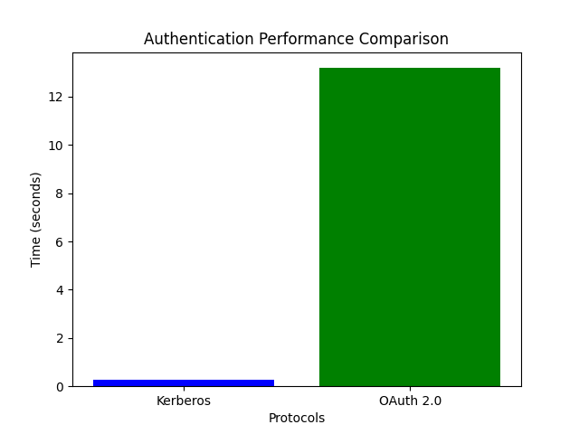

# Cryptographic and Authentication Protocol Comparison
# Test Environment: Intel i7-9750H CPU @ 2.60GHz, 16GB RAM
# Network: Local test environment, 1Gbps connection

## Results
- **Kerberos Authentication Time**: 0.3351786136627197 seconds
- **OAuth 2.0 Authentication Time**: 12.306443929672241 seconds

## User Info from OAuth
```json
  {'login': 'aliabbascheema', 'id': 183813765, 'node_id': 'U_kgDOCvTGhQ', 'avatar_url': 'https://avatars.githubusercontent.com/u/183813765?v=4', 'gravatar_id': '', 'url': 'https://api.github.com/users/aliabbascheema', 'html_url': 'https://github.com/aliabbascheema', 'followers_url': 'https://api.github.com/users/aliabbascheema/followers', 'following_url': 'https://api.github.com/users/aliabbascheema/following{/other_user}', 'gists_url': 'https://api.github.com/users/aliabbascheema/gists{/gist_id}', 'starred_url': 'https://api.github.com/users/aliabbascheema/starred{/owner}{/repo}', 'subscriptions_url': 'https://api.github.com/users/aliabbascheema/subscriptions', 'organizations_url': 'https://api.github.com/users/aliabbascheema/orgs', 'repos_url': 'https://api.github.com/users/aliabbascheema/repos', 'events_url': 'https://api.github.com/users/aliabbascheema/events{/privacy}', 'received_events_url': 'https://api.github.com/users/aliabbascheema/received_events', 'type': 'User', 'user_view_type': 'public', 'site_admin': False, 'name': None, 'company': None, 'blog': '', 'location': None, 'email': None, 'hireable': None, 'bio': None, 'twitter_username': None, 'notification_email': None, 'public_repos': 4, 'public_gists': 0, 'followers': 0, 'following': 1, 'created_at': '2024-10-04T09:29:15Z', 'updated_at': '2024-12-05T05:26:22Z'}
```
## Performance Chart
